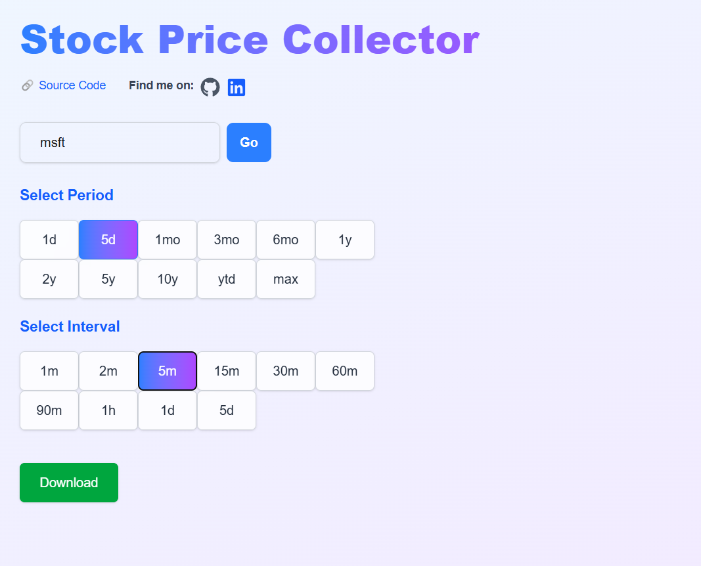

# 📊 Stock Price Collector

A full-stack, user-friendly tool for exploring stock data — offering interactivity, instant feedback, and customizable download  

---

## 🌐 Interactive Website

Check out the live website here:  
👉 [Take me there!](https://stock-price-collector.vercel.app/)

Sneak peak at the view:

---

## 🚀 Features

- ✅ Validate stock symbols inputted by user via backend API
- 📅 Allow custom **periods** and **intervals** for historical data
- 🧾 Download stock data as `.csv`
- 📈 (Coming soon) Visualize price trends with Matplotlib

---

## 🛠️  How It Works

### 🧩 Frontend (Next.js + Tailwind)

The frontend is built using **Next.js (App Router)** and styled with **Tailwind CSS**.  
It features a clean, responsive interface where users can:

- Enter a stock ticker symbol (e.g. AAPL, TSLA)
- Select a time **period** and **interval** using interactive button components
- Get instant feedback on symbol validity
- Download stock price data as a `.csv` file

The app is fully responsive and deployed to **Vercel**.

---

### 🔌 Backend (Flask)

The backend is a **Flask-based REST API**, deployed to **Render**, and handles:

- **Validating stock symbols** through lookup in Yahoo Finance
- **Fetching historical stock data** based on selected period & interval through custom HTTP requests
- **Generating downloadable CSVs** on demand, using in-memory file streams (`BytesIO`)

---

## 🧠 Planning & Design

This was the initial planning diagram I made to structure the project:

---

<!-- ## 🧪 Current Progress

The following is the current state of the project, showing:
- Validating a stock symbol
- Period and interval selection buttons with highlighted states

--- -->

