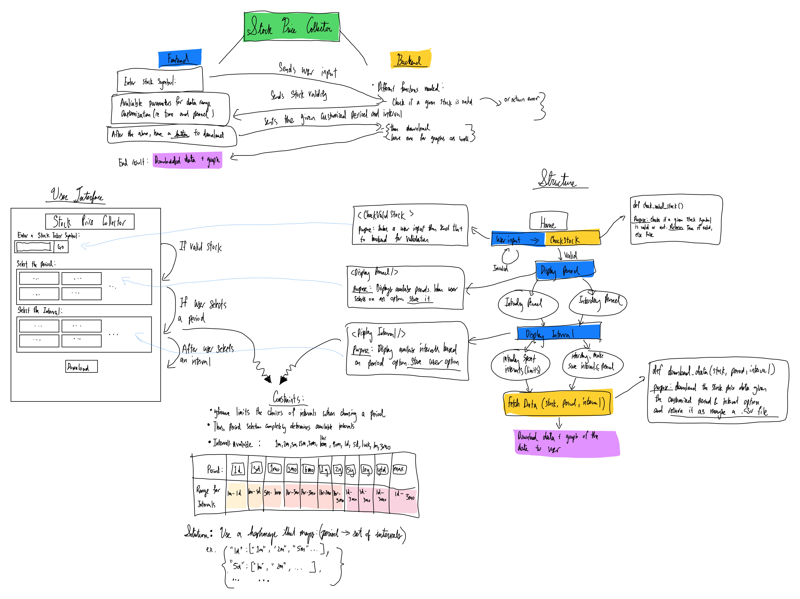
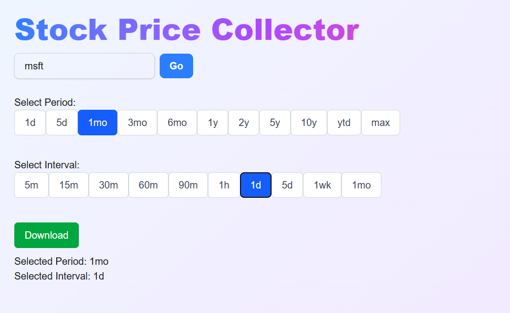

# 📊 Stock Price Collector

A full-stack stock data tool built with **Next.js** and **Flask REST API**.  
Enter a stock symbol, select a period and interval range, download stock data.  

---

## 🚀 Features

- ✅ Validate stock symbols inputted by user via backend API
- 📅 Allow custom **periods** and **intervals** for historical data
- 📈 (Coming soon) Visualize price trends with Matplotlib
- 🧾 (Coming soon) Download stock data as `.csv` or `.xlsx`
- 🌐 (Coming soon) **Interactive Website**

---

## 🛠️ Technologies Used

### Frontend:
- Next.js
- Tailwind CSS (for styling)
- React hooks (`useState`)

### Backend:
- Flask (REST API)
- yfinance (for stock data)
- Pandas (for formatting/exports)

---

## 🧠 Planning & Design

This was the initial planning diagram I made to structure the project:

---

## 🧪 Current Progress

The following is the current state of the project, showing:
- Validating a stock symbol
- Period and interval selection buttons with highlighted states

---

